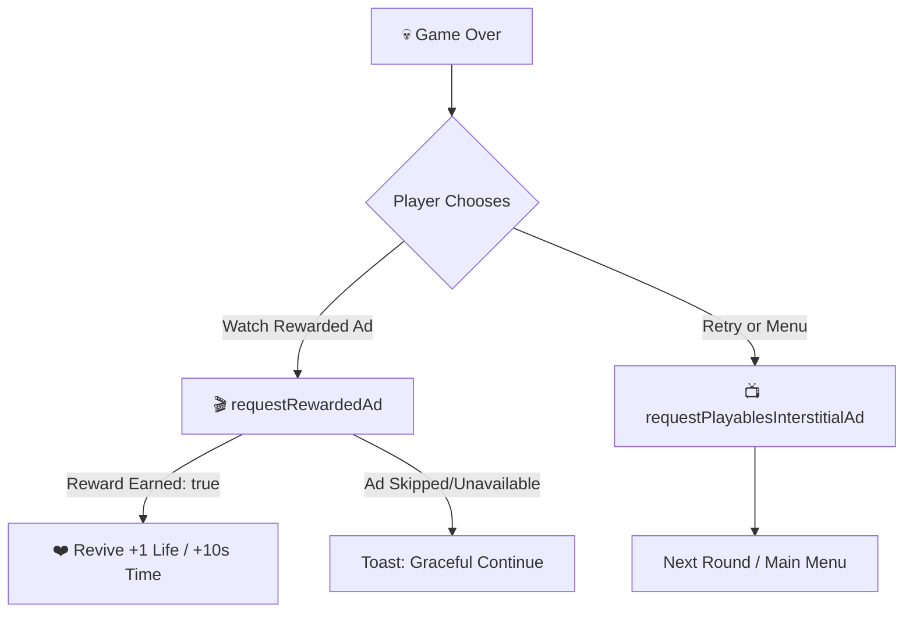

<div align="center">

# ⚡ SUDDEN STOP CHALLENGE

### *High-Octane Precision Tapping Game Built for YouTube Playables*

[](https://developers.google.com/youtube/gaming/playables)
[](https://www.typescriptlang.org/)
[](https://react.dev/)
[](https://vitejs.dev/)
[](https://tailwindcss.com/)
[](https://vitest.dev/)
[](LICENSE)

<br/>

**Stop at exactly the right millisecond. Chain perfect streaks. Outsmart escalating modifiers. Beat your ghost.**

[🎮 Playables SDK Architecture](#-youtube-playables-sdk-integration) • [💰 Monetization & Ads](#-built-in-monetization--ads) • [🕹 Game Modes](#-game-modes) • [🛡 CSP & Certification](#-security--content-security-policy-csp) • [🚀 Quick Start](#-getting-started)

<br/>

```
┌────────────────────────────────────────────────────────────────────────┐
│  SCORE: 340                ROUND: 7/10                  COMBO: x5 🔥   │
├────────────────────────────────────────────────────────────────────────┤
│                                                                        │
│   [═══════════░░░░░░░░░░░░░░░░[  ⚡  ]░░░░░░░░░░░░░░░░░════════════]    │
│               ▲               │  │               ▲                     │
│           TARGET ZONE      PERFECT STOP       GHOST PB                 │
│                                                                        │
│                       >>> TAP AT THE TARGET <<<                        │
└────────────────────────────────────────────────────────────────────────┘
```

</div>

---

## 🌟 Overview

**Sudden Stop Challenge** is an adrenaline-fueled, single-tap reflex game engineered specifically for the **YouTube Playables** platform. Designed for fast mobile sessions, browser gameplay, and instant responsiveness across any device or screen orientation.

An orb accelerates back and forth across a precision-calibrated neon track. Players must tap or press Space at the exact sub-millisecond instant the orb enters the target zone. Score multiplier streaks, power-ups, ghost replay benchmarks, and rotating modifiers make every run fresh, competitive, and replayable.

---

## 🕹 Game Modes

| Mode | Mechanics | Victory Condition |
| :--- | :--- | :--- |
| **🎯 Classic** | 10 rapid rounds with speed increasing each stage. | Complete all 10 rounds with maximum accuracy score. |
| **❤️ Survival** | Endless rounds with 3 lives. Misses cost 1 life. | Survive as long as possible and post high scores to YouTube. |
| **⏱ Time Attack** | 30-second countdown sprint. Hit targets to score fast. | Rack up the highest score before the clock hits zero. |
| **🎛 Practice Lab** | Adjustable fixed speed slider (1.5× to 8.0×). | Zero pressure training ground to hone target reflexes. |
| **⭐ Daily Challenge** | Seeded daily modifier (Tiny Zone, Mirror Track, Double Speed). | Compete on universal daily seed with personal best tracking. |
| **🗓 Weekly Challenge**| Curated weekly modifier with up to 2.5× score multipliers. | Master special weekly modifiers for massive leaderboard gains. |
| **👻 Race Your Best** | Deterministic ghost replay re-enacting your personal best. | Visual ghost marker on track competing against your top run. |

---

## ⚡ Power-Ups & Modifiers

- 🔍 **Wider Zone**: Expands target zone width by **+60%** for easier scoring.
- ⏳ **Slow Motion**: Cuts orb velocity by **50%** for pinpoint timing.
- 🧲 **Magnetic Pull**: Attracts nearby misses into the target boundary.
- 💎 **Score Multiplier**: Multiplies round score by **2× to 3×**.
- 🛡 **Shield / Revive**: Protects your streak or revives via Rewarded Ad.

---

## 📺 YouTube Playables SDK Integration

Sudden Stop Challenge adheres to **100% of the YouTube Playables certification and integration guidelines**, with full type safety via [`src/types/ytgame.d.ts`](src/types/ytgame.d.ts) and clean SDK wrappers in [`src/game/youtubePlayables.ts`](src/game/youtubePlayables.ts).

### 🏷 SDK Import Rule
The SDK script is guaranteed to load **before any game code** in `index.html`:
```html
<!-- index.html -->
<head>
  ...
</head>
<body>
  <div id="root"></div>
  <!-- YouTube Playables SDK v1 MUST precede game application scripts -->
  <script src="https://www.youtube.com/game_api/v1"></script>
  <script type="module" src="/src/main.tsx"></script>
</body>
```

### 📋 Full SDK API Coverage Matrix

| Category | Function / Property | Implementation in Sudden Stop | Status |
| :--- | :--- | :--- | :---: |
| **Lifecycle** | `ytgame.game.firstFrameReady()` | Triggered immediately on first animation frame rendering. | ✅ Certified |
| **Lifecycle** | `ytgame.game.gameReady()` | Dispatched once UI is fully hydrated and interactable. | ✅ Certified |
| **Environment**| `ytgame.IN_PLAYABLES_ENV` | Detects Playables vs local development; drives auto-fallback. | ✅ Certified |
| **Environment**| `ytgame.SDK_VERSION` | Logs and identifies runtime SDK version. | ✅ Certified |
| **Cloud Save** | `ytgame.game.loadData()` | Loads high scores, ghost runs, settings, and player stats. | ✅ Certified |
| **Cloud Save** | `ytgame.game.saveData(data)` | Validates UTF-16 well-formedness and enforces 3 MiB limit. | ✅ Certified |
| **Audio** | `ytgame.system.isAudioEnabled()` | Initializes game sound according to player's YouTube preferences.| ✅ Certified |
| **Audio** | `ytgame.system.onAudioEnabledChange()`| Live syncs master volume when player toggles YouTube audio. | ✅ Certified |
| **System** | `ytgame.system.onPause()` | Pauses active animations/timers and performs emergency save. | ✅ Certified |
| **System** | `ytgame.system.onResume()` | Restores game loop and displays seamless resume state. | ✅ Certified |
| **Locale** | `ytgame.system.getLanguage()` | Retrieves user BCP-47 language tag to configure locale. | ✅ Certified |
| **Engagement** | `ytgame.engagement.sendScore()` | Sends safe integer scores to YouTube leaderboards. | ✅ Certified |
| **Engagement** | `ytgame.engagement.openYTContent()` | Opens YouTube video tutorials and Playables hub links. | ✅ Certified |
| **Health** | `ytgame.health.logError()` | Reports runtime exceptions and unhandled promise rejections. | ✅ Certified |
| **Health** | `ytgame.health.logWarning()` | Non-fatal issue reporting and diagnostic telemetry. | ✅ Certified |
| **Monetization**| `ytgame.ads.requestInterstitialAd()`| Displays interstitial ad between games / at menu transitions. | ✅ Certified |
| **Monetization**| `ytgame.ads.requestRewardedAd()` | Rewards players with "+1 Life Revive" or bonus time. | ✅ Certified |

---

## 💰 Built-in Monetization & Ads

Sudden Stop Challenge implements non-intrusive, player-first ads that enhance retention while generating revenue:



### 1. Pre-Roll Ads
- Handled automatically by the YouTube platform container upon initial game load. No extra code required.

### 2. Interstitial Ads (`ytgame.ads.requestInterstitialAd()`)
- Triggered at natural gameplay breakpoints: between games or upon returning to the main menu from Game Over.
- Includes a **45-second cooldown guard** to protect player experience and prevent ad spam on quick retries.

### 3. Rewarded Ads (`ytgame.ads.requestRewardedAd()`)
- **Second Chance Revive**: When out of lives in Survival mode or out of time in Time Attack, players can opt into watching a short ad to continue their streak with `+1 ❤️` or `+10s ⏱`.
- Hardcoded reward ID: `"sudden-stop-revive"`.
- Seamless error handling: If the ad fails or is closed early, the game does not crash or lock up; it gracefully notifies the player.

---

## 🛡 Security & Content Security Policy (CSP)

When running within YouTube Playables, games must operate within strict sandboxing and Content Security Policy restrictions. Sudden Stop Challenge is fully compliant with the official Playables CSP:

```http
default-src 'none'; 
script-src 'report-sample' 'self' 'unsafe-eval' 'unsafe-inline' blob: https://www.youtube.com/game_api/v0 https://www.youtube.com/game_api/v0/ https://www.youtube.com/game_api/v1 https://www.youtube.com/game_api/v1/; 
object-src 'none'; 
style-src 'self' 'unsafe-inline' https://fonts.googleapis.com; 
img-src 'self' blob: data:; 
media-src 'self' blob:; 
font-src 'self' data: https://fonts.googleapis.com https://fonts.gstatic.com; 
connect-src 'self' blob: data:; 
sandbox allow-pointer-lock allow-same-origin allow-scripts; 
base-uri 'self'; 
manifest-src 'self'; 
worker-src 'self' blob:
```

---

## 🧪 Testing with Playables Test Suite

### 1. Automated Vitest Suite
Run the comprehensive suite verifying SDK order, methods, and types:
```bash
npm run test
```
All 12 compliance tests validate:
- Early SDK inclusion in `index.html`.
- Lifecycle dispatch sequence (`firstFrameReady` ➔ `gameReady`).
- Audio synchronization and unregister cleanup.
- Safe integer score constraints for `sendScore`.
- Rewarded and Interstitial ads execution logic.
- Cloud save 3 MiB and UTF-16 well-formed checks.

### 2. Official YouTube Playables Portal Validation
1. Build the production package:
   ```bash
   npm run build
   ```
2. Compress the contents of the `dist/` folder into a `.zip` archive.
3. Upload to the **[YouTube Playables Developer Portal](https://www.youtube.com/playables_portal)**.
4. Launch the **Playables Test Suite** and verify all automated checks (SDK order, audio mute, pause/resume, cloud save, ads).

---

## 🚀 Getting Started

### Prerequisites
- **Node.js**: v18.0.0 or higher
- **npm** or **bun**

### Installation
```bash
# Clone the repository
git clone https://github.com/Rahul08319/sudden-stop-challenge.git
cd sudden-stop-challenge

# Install dependencies
npm install
```

### Local Development Server
```bash
npm run dev
```
Open `http://localhost:5173` to test locally. The Playables SDK operates in auto-fallback mode with `localStorage` and simulated ad callbacks when run outside YouTube.

### Code Verification
```bash
# Run unit & compliance tests
npm run test

# Run ESLint quality checks
npm run lint

# Build production bundle
npm run build
```

---

## ⌨️ Controls

| Input | Action |
| :--- | :--- |
| **Tap / Left Click** | Stop moving orb / Select UI / Claim Revive |
| **Space / Enter** | Stop moving orb (Keyboard) |
| **F** | Toggle Fullscreen |
| **Esc** | Pause / Back to Menu / Exit Fullscreen |

---

## 🏗 Tech Stack & Architecture

- **Core Engine**: React 18, TypeScript 5, Vite 5
- **SDK**: YouTube Playables Web SDK v1
- **Styling**: Tailwind CSS, PostCSS, Lucide Icons, Shadcn UI
- **Audio & Haptics**: Web Audio API Synthesizer (Zero asset latency) + Capacitor Haptics
- **Testing**: Vitest, React Testing Library, JSDOM

```
sudden-stop-challenge/
├── index.html                   # SDK v1 loaded before main.tsx
├── src/
│   ├── types/
│   │   └── ytgame.d.ts          # Complete YouTube Playables SDK v1 Typings
│   ├── game/
│   │   ├── SuddenStopGame.tsx   # Core game loop, HUD, Revives & Ads UI
│   │   ├── youtubePlayables.ts  # Production SDK wrapper & fallback logic
│   │   ├── playablesCompliance.test.ts # 100% compliance test suite
│   │   ├── audio.ts             # Web Audio API procedural sound engine
│   │   ├── ghostReplay.ts       # Deterministic ghost run recording
│   │   ├── dailyChallenge.ts    # Seeded daily challenge generator
│   │   ├── weeklyChallenge.ts   # Curated weekly challenge rules
│   │   └── powerups.ts          # Gameplay power-up definitions
│   ├── App.tsx                  # Root app layout & Sonner notification toast
│   └── main.tsx                 # Entrypoint wiring firstFrameReady & gameReady
└── package.json
```

---

<div align="center">

Made with ❤️ for high-precision gamers on **YouTube Playables**.

⭐ Star this repository if you enjoy precision timing games!

</div>
