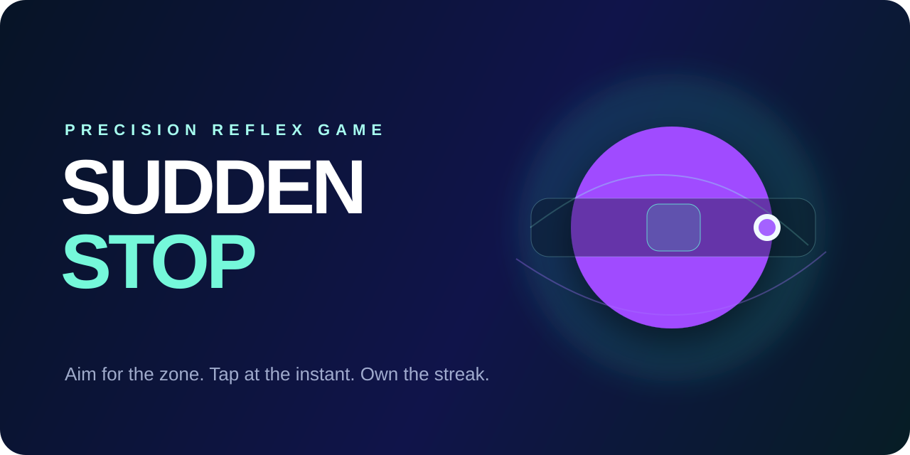
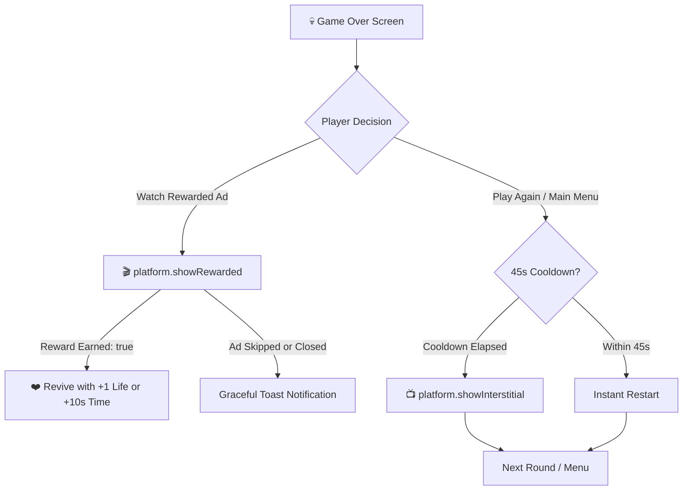

<div align="center">



# ⚡ SUDDEN STOP CHALLENGE
### *Next-Generation Reflex Gaming Engine • Universal Multi-Platform SDK (Zero-Playgama) • Apple Design System*

<br/>

<!-- PLATFORM BADGES ROW 1 -->
[](https://developers.google.com/youtube/gaming/playables)
[](https://developers.facebook.com/docs/games)
[](https://poki.com)
[](https://developer.crazygames.com)
[](https://yandex.com/dev/games/)

<!-- PLATFORM BADGES ROW 2 -->
[](https://gamedistribution.com)
[](https://discord.com/developers/docs/activities/overview)
[](https://jiogames.com)
[](https://y8.com)
[](https://lagged.com)

<!-- PLATFORM BADGES ROW 3 -->
[](https://microsoft.com/store)
[](https://developer.huawei.com)
[](https://reddit.com)
[](https://apple.com)

<!-- TECH STACK BADGES -->
[](https://vitest.dev)
[](https://www.typescriptlang.org/)
[](https://react.dev/)
[](src/platform)
[](src/index.css)
[](LICENSE)

<br/>

**Stop at the exact sub-millisecond. Chain perfect precision streaks. Master rotating daily and weekly physics modifiers. Play everywhere with zero third-party aggregator lock-in.**

[🎮 Playable Platforms](#-universal-platform-sdk-ups--zero-playgama) • [🍏 Apple Design System](#-apple-design-system-overhaul) • [🕹 Game Modes](#-game-modes) • [💰 Ads & Monetization](#-unified-monetization-architecture) • [🚀 Quick Start](#-getting-started) • [🧪 116 Unit Tests](#-testing--compliance)

<br/>

```
┌─────────────────────────────────────────────────────────────────────────────┐
│  APPLE LIQUID GLASS BENTO INTERFACE                     [ ⚡ UNIVERSAL ]   │
├─────────────────────────────────────────────────────────────────────────────┤
│                                                                             │
│   [  ▶ YOUTUBE PLAYABLES  ▾  ]        [ 🏆 BEST: 420 ]    [ 🔊 AUDIO: ON ]  │
│                                                                             │
│   ┌─────────────────────────────────────────────────────────────────────┐   │
│   │  ⚡ SUDDEN STOP                              [ ▶ PLAY NOW ]         │   │
│   │  Classic • Survival • Time Attack            Action Blue CTA        │   │
│   └─────────────────────────────────────────────────────────────────────┘   │
│   ┌───────────────────────────────┐   ┌─────────────────────────────────┐   │
│   │  ⭐ DAILY CHALLENGE           │   │  🗓 WEEKLY SPECIAL EVENT        │   │
│   │  Seed: #2026-09-22            │   │  Physics: Micro Zone Multiplier │   │
│   └───────────────────────────────┘   └─────────────────────────────────┘   │
│   ┌───────────────────────────────┐   ┌─────────────────────────────────┐   │
│   │  🎛 PRACTICE DRILL            │   │  👻 RACE BEST GHOST             │   │
│   │  Variable speed calibration   │   │  Replay against top PB          │   │
│   └───────────────────────────────┘   └─────────────────────────────────┘   │
│                                                                             │
│   [ 🏆 Leaderboards ]       [ 🎨 Skins Lab ]       [ ⚙️ Settings ]          │
│                                                                             │
└─────────────────────────────────────────────────────────────────────────────┘
```

</div>

---

## 🌟 What is Sudden Stop?

**Sudden Stop Challenge** is an ultra-fast, precision timing game engineered for instant web distribution. A high-speed runner accelerates back and forth across a calibrated track. Players must hit the stop action at the exact millimeter apex. A difference of 10 milliseconds separates a **PERFECT STOP (100 pts + Streak)** from a **MISS**.

Rebuilt from the ground up with:
1. **Universal Platform SDK (UPS)**: Native TypeScript adapters for **13 major gaming platforms** + Standalone Web PWA with **zero Playgama dependencies**.
2. **Apple Design System**: Full Human Interface Guidelines (HIG) aesthetics featuring **Liquid Glass** blur materials, **SF Pro** typography, **Bento Grid** responsive layout, and **spring physics** motion.
3. **Multi-Platform Monetization**: Non-intrusive interstitial cooldowns and Rewarded Ad Revives (`+1 ❤️` or `+10s ⏱`).

---

## 🍏 Apple Design System Overhaul

Sudden Stop incorporates the core tenets of Apple interface design:

### 1. Liquid Glass Surfaces (`.apple-glass`, `.apple-glass-card`)
- Multi-layered frosted glass with high-index optical refraction:
  ```css
  background: rgba(28, 28, 30, 0.65);
  backdrop-filter: blur(24px) saturate(180%);
  -webkit-backdrop-filter: blur(24px) saturate(180%);
  border: 1px solid rgba(255, 255, 255, 0.14);
  box-shadow: 0 8px 32px 0 rgba(0, 0, 0, 0.37);
  ```
- Specular highlight gradients on top borders mimicking physical glass edges.

### 2. SF Pro Typography & Optical Tracking
- Native font stack: `-apple-system, BlinkMacSystemFont, "SF Pro Display", "SF Pro Text", system-ui, sans-serif`.
- Negative letter-spacing for large hero displays (`tracking-tight`, `font-black`).
- Display P3 gamut-aware color tokens and system dark surfaces (`#000000`, `#1c1c1e`, `#2c2c2e`).

### 3. Apple Action Blue Accent & Continuous Squircles
- Primary call-to-action uses Apple Action Blue (`#0071e3`, hover `#0077ed`).
- Smooth continuous superellipse corner curvature (`border-radius: 24px-28px; corner-smoothing: continuous`).

### 4. Interactive Bento Grid Layout
- Modular Bento cells on the home menu highlighting Daily Challenges, Weekly Physics Events, Practice Drill, and Ghost Replays.
- Built-in **Platform Switcher Sheet** allowing instant runtime switching between all 14 platform configurations directly in the UI.

---

## 🌐 Universal Platform SDK (UPS) — Zero Playgama

Most multi-platform HTML5 games rely on heavy, closed-source wrapper libraries like Playgama SDK which introduce vendor lock-in, tracking cookies, and revenue-share overhead. 

**Sudden Stop Challenge features an open-source native abstraction layer** located in [`src/platform/`](src/platform/):
- **100% Native**: Communicates directly with official platform APIs and globals.
- **Zero Third-Party Aggregator Overhead**: 0 external runtime dependencies.
- **Unified Facade**: [`platformManager.ts`](src/platform/platformManager.ts) automatically detects the environment or falls back safely to LocalStorage and simulated callbacks in local development.

### 📊 Platform Capability Matrix

| Platform | Global API / Engine | Cloud Save | Leaderboards | Interstitial Ads | Rewarded Ads | Audio Sync | Pause / Resume |
| :--- | :--- | :---: | :---: | :---: | :---: | :---: | :---: |
| **YouTube Playables** | `window.ytgame` v1 | ✅ (3 MiB) | ✅ | ✅ | ✅ | ✅ | ✅ |
| **Facebook Instant** | `window.FBInstant` | ✅ | ✅ | ✅ | ✅ | ✅ | ✅ |
| **Poki** | `window.PokiSDK` | ✅ | ✅ | ✅ | ✅ | ✅ | ✅ |
| **CrazyGames** | `window.CrazyGames.SDK` | ✅ | ✅ | ✅ | ✅ | ✅ | ✅ |
| **Yandex Games** | `window.YaGames` | ✅ | ✅ | ✅ | ✅ | ✅ | ✅ |
| **GameDistribution** | `window.gdsdk` | ✅ | ➖ | ✅ | ✅ | ✅ | ✅ |
| **Discord Activities** | Discord RPC / Embedded | ✅ | ✅ | ➖ | ➖ | ✅ | ✅ |
| **JioGames** | `window.JioGames` | ✅ | ✅ | ✅ | ✅ | ✅ | ✅ |
| **Y8 Games** | `window.ID` | ✅ | ✅ | ✅ | ✅ | ✅ | ✅ |
| **Lagged** | `window.LaggedAPI` | ✅ | ✅ | ✅ | ✅ | ✅ | ✅ |
| **Microsoft Store** | PWA + Service Worker | ✅ | ✅ | ✅ | ✅ | ✅ | ✅ |
| **Huawei & Xiaomi** | `window.qg` Quick Games | ✅ | ✅ | ✅ | ✅ | ✅ | ✅ |
| **MSN & Reddit** | Web Sandbox / iFrame | ✅ | ✅ | ✅ | ✅ | ✅ | ✅ |
| **Standalone / Web** | LocalStorage + PWA | ✅ | ✅ | ✅ (Sim) | ✅ (Sim) | ✅ | ✅ |

---

## 🕹 Game Modes

| Mode | Rules & Objectives | Multipliers & Rewards |
| :--- | :--- | :--- |
| **🎯 Classic** | 10 rapid rounds with progressive velocity scaling. | Multiplier builds on consecutive Perfect stops. |
| **❤️ Survival** | Endless survival with 3 lives. Misses deplete a heart. | Continuous streak scoring + Rewarded Ad second chance. |
| **⏱ Time Attack** | 30-second rapid-fire countdown. Score fast. | Hits add seconds to the clock. Rewarded ad adds `+10s`. |
| **🎛 Practice Lab** | Adjustable fixed speed slider (1.5× to 8.0×). | Zero-stress calibration mode for reflex training. |
| **⭐ Daily Challenge** | Universal daily seed with unique modifier. | Global daily ranking + PB tracking. |
| **🗓 Weekly Challenge**| Weekly modifier (Ghost Zone, Mirror, Micro Zone). | High-stakes score multipliers (up to 2.5×). |
| **👻 Race Best Ghost**| Play alongside a live ghost visualization of your PB. | Visual benchmark of your best-ever timing. |

---

## 💰 Unified Monetization Architecture

The game uses player-friendly, non-intrusive monetization compliant with YouTube, Poki, CrazyGames, and Facebook ad policies:



1. **Pre-Roll Ads**: Handled naturally by hosting platforms upon game boot.
2. **Interstitial Ads**: Displayed at natural game-over transitions with an enforced **45-second cooldown guard** to prevent user fatigue.
3. **Rewarded Ads (Revive)**: Players can watch an ad to revive with `+1 ❤️` in Survival or `+10s ⏱` in Time Attack.

---

## 🧪 Testing & Compliance

Sudden Stop includes a comprehensive, automated Vitest test suite with **116 passing tests**:

```bash
npm test
```

```
 RUN  v3.2.7

 ✓ src/test/example.test.ts (1 test)
 ✓ src/game/playablesCompliance.test.ts (11 tests)
 ✓ src/platform/platformAdapters.test.ts (104 tests)

 Test Files  3 passed (3)
      Tests  116 passed (116)
   Duration  7.18s
```

- **YouTube Playables Certification** ([`playablesCompliance.test.ts`](src/game/playablesCompliance.test.ts)):
  - Validates SDK load order before game bundle in `index.html`.
  - Verifies UTF-16 encoding and 3 MiB payload constraints for cloud saves.
  - Tests `firstFrameReady()`, `gameReady()`, lifecycle pauses, and ad hooks.
- **Universal Multi-Platform Suite** ([`platformAdapters.test.ts`](src/platform/platformAdapters.test.ts)):
  - Verifies initialization, cloud save/load round-tripping, score submissions, and ad handlers across **all 14 platform adapters**.
  - Verifies dynamic platform switching via `platformManager`.

---

## 🚀 Getting Started

### Prerequisites
- Node.js 18+
- npm or yarn

### Installation
```bash
git clone https://github.com/Rahul08319/sudden-stop-challenge.git
cd sudden-stop-challenge
npm install
```

### Running Locally
```bash
npm run dev
```

### Testing Platforms in Local Development
You can simulate any target platform environment directly in your browser:
- YouTube Playables: `http://localhost:5173/?platform=youtube`
- Facebook Instant Games: `http://localhost:5173/?platform=facebook`
- Poki: `http://localhost:5173/?platform=poki`
- CrazyGames: `http://localhost:5173/?platform=crazygames`
- Yandex Games: `http://localhost:5173/?platform=yandex`
- Discord Activities: `http://localhost:5173/?platform=discord`
- Or use the **in-game Apple Platform Switcher** modal by tapping the top platform pill!

---

## 📦 Building for Distribution

To build for all platforms or target specific stores:

```bash
# Universal Production Build
npm run build

# Platform-Specific Builds (relative asset paths for iframe / sandboxed hosts)
npm run build:yt            # YouTube Playables
npm run build:fb            # Facebook Instant Games
npm run build:poki          # Poki
npm run build:crazygames    # CrazyGames
npm run build:yandex        # Yandex Games
npm run build:gamedistribution
npm run build:msstore       # Microsoft Store PWA
npm run build:quickgame     # Huawei & Xiaomi Quick Games
```

All production assets are bundled to `dist/` with optimized chunk sizes, gzip compression, and offline service worker caching (`public/sw.js`).

---

## 📄 License

This project is open-source under the [MIT License](LICENSE).
Built with ❤️ for precision reflex gamers across the globe.
